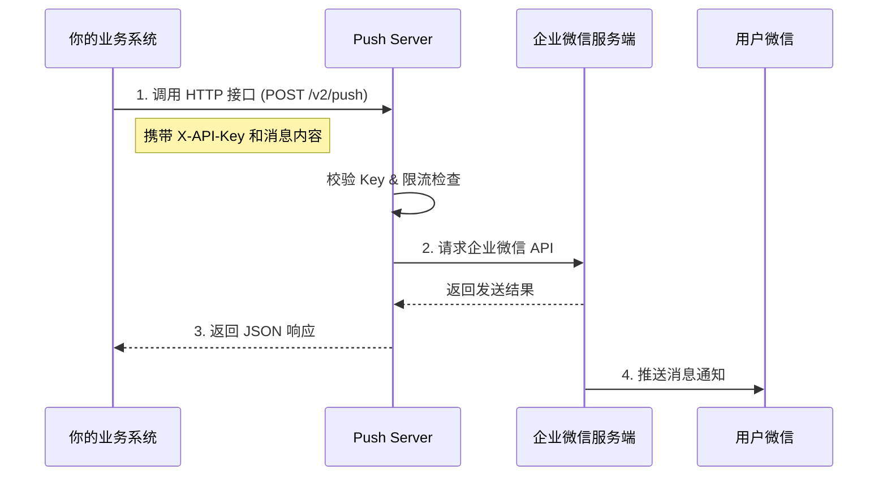

# 快速开始

Push Server 是一个基于 Spring Boot 3 和 GraalVM Native Image 构建的轻量级企业微信消息推送服务。

## 工作原理



## 前置准备

::: warning 注意事项
在使用本服务之前，请确保你已经拥有企业微信管理员权限，并且能够创建自建应用。
:::

1. **注册企业微信**：如果您还没有企业微信账号，请先注册。
2. **创建自建应用**：
   - 登录企业微信管理后台。
   - 进入“应用管理” -> “自建” -> “创建应用”。
   - 创建完成后，记录下 `AgentId` 和 `Secret`。
   - 在“我的企业”中查看并记录 `CorpId` (企业ID)。
3. **关注插件**：用户需要在个人微信中关注企业微信插件，以便直接在微信中接收消息。

## 部署方式

推荐使用 Docker 进行部署，无需安装 Java 环境。

### 方式一：Docker 命令行 (最简单)

直接运行容器，通过环境变量传入配置：

```bash
docker run -d \
  --name push-server \
  -p 8000:8000 \
  -e PUSH_AUTH_KEY=your_secret_key \
  -e PUSH_WECOM_APP_KEY=your_corp_id \
  -e PUSH_WECOM_APP_SECRET=your_app_secret \
  -e PUSH_WECOM_AGENT_ID=your_agent_id \
  ccr.ccs.tencentyun.com/qingzhou/push-server:latest
```

### 方式二：挂载配置文件 (推荐)

如果你有较多的配置项，或者希望配置更易于管理，可以创建一个配置文件。

1. 创建 `application-prod.yml` 文件：

```yaml
push:
  auth:
    key: "your_secret_key" # 自定义鉴权 Key，调用 API 时需放在 Header X-API-Key 中
  wecom:
    app-key: "your_corp_id"      # 企业 ID
    app-secret: "your_app_secret" # 应用 Secret
    agent-id: 1000001             # 应用 AgentId
  security:
    block-minutes: 60       # 封禁时长
    fail-window-minutes: 5  # 失败统计窗口
    max-fails: 5            # 允许最大失败次数
    rate-limit-capacity: 100 # 令牌桶容量
    rate-limit-qps: 10       # 每秒生成令牌数
```

2. 运行 Docker 容器并挂载配置：

```bash
docker run -d \
  --name push-server \
  -p 8000:8000 \
  -v $(pwd)/application-prod.yml:/workspace/config/application-prod.yml \
  ccr.ccs.tencentyun.com/qingzhou/push-server:latest
```

### 方式三：Docker Compose

创建 `docker-compose.yml`：

```yaml
version: '3' 
services:
  push-server:
    image: ccr.ccs.tencentyun.com/qingzhou/push-server:latest
    container_name: push-server
    ports:
      - "8000:8000"
    volumes:
      - ./application-prod.yml:/workspace/config/application-prod.yml
    restart: always
```

运行：

```bash
docker-compose up -d
```
