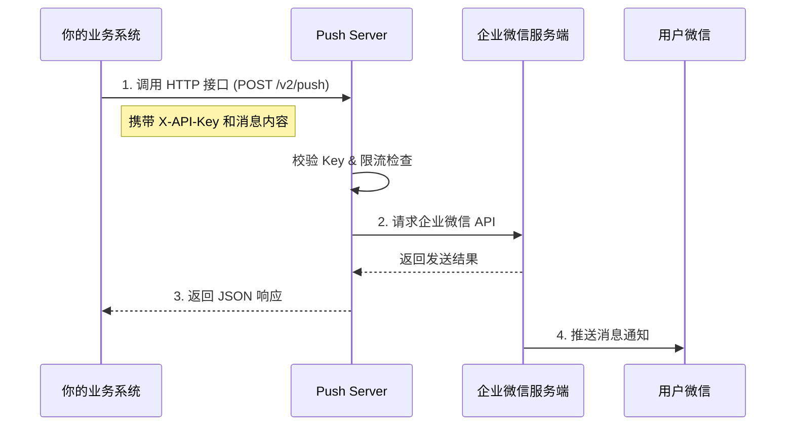
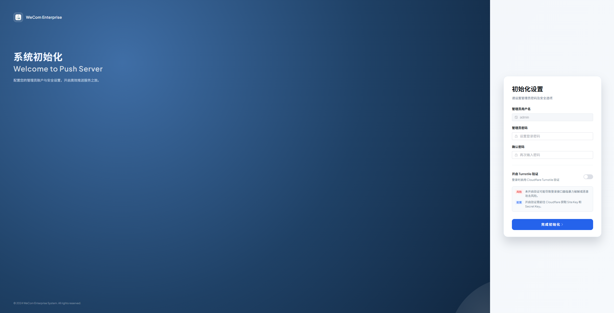

# 快速开始

Push Server 是一个基于 Spring Boot 4 和 GraalVM Native Image 构建的轻量级企业微信消息推送服务。

## 工作原理



## 前置准备

::: warning 注意事项
在使用本服务之前，请确保你已经拥有企业微信管理员权限，并且能够创建自建应用。
:::

[注册企业微信教程](register-wechat.md)

## 部署方式

推荐使用 Docker 进行部署，无需安装 Java 环境。

### 方式一：Docker 命令行 (最简单)

直接运行容器：

```bash
docker run -d \
  --name push-server \
  -p 8000:8000 \
  -v $(pwd)/data:/app/data \
  qingzhoudev/push-server:latest
```
- 数据持久化：-v $(pwd)/data:/app/data粘贴应用数据（包括SQLite数据库）保存到当前目录下的data文件夹中。
- 首次运行：启动后，访问http://localhost:8000，系统会自动启动至初始化页面。请根据引导完成管理员账号注册和企业微信配置。


### 方式二：Docker Compose

创建 `docker-compose.yml`：

```yaml
services:
  push-server:
    image: qingzhoudev/push-server:latest
    container_name: push-server
    ports:
      - "8000:8000"
    volumes:
      - ./data:/app/data
    restart: unless-stopped
```

运行：

```bash
docker-compose up -d
```

### 访问页面

开始初始化


