## 操作手册

### 一、初始化

> 首次访问网站会检测是否完成初始化，如果没有进行初始化会进入初始化页面，初始化后不会再次进入，
> 目前页面没有重置功能，可以手动删除数据库文件完成重置。

在这个页面，我们可以是设置密码和 **Cloudflare Turnstile** 智能 CAPTCHA 替代方案

::: warning **警告**
需要注意Cloudflare Turnstile 需要添加主机名，添加后需要带手动点击**更新**，侧边栏添加后不点**更新**也是不生效的
:::

### 二、登录
设置完成后自动跳转到登录页面

正常登录即可

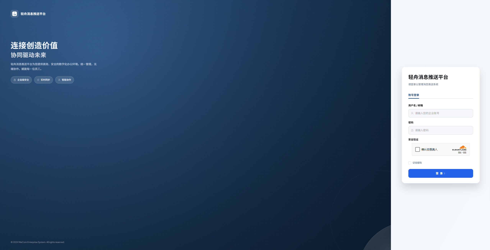

### 三、首页

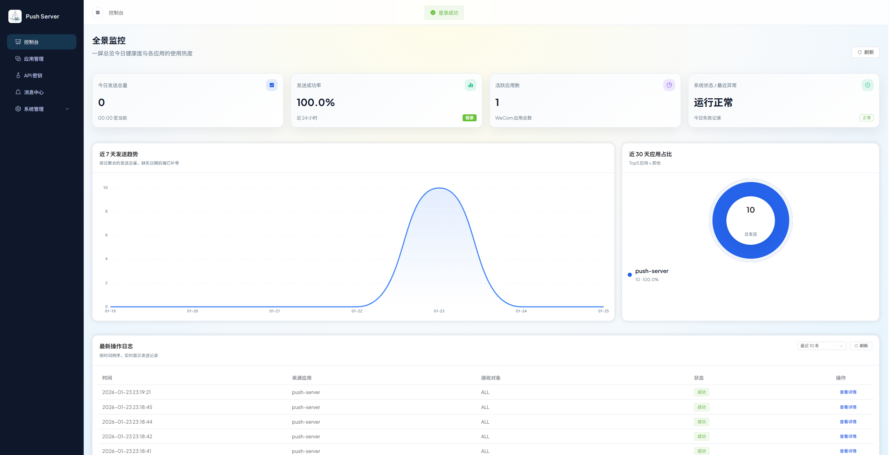

### 四、企业配置

这里配置企业微信的企业ID

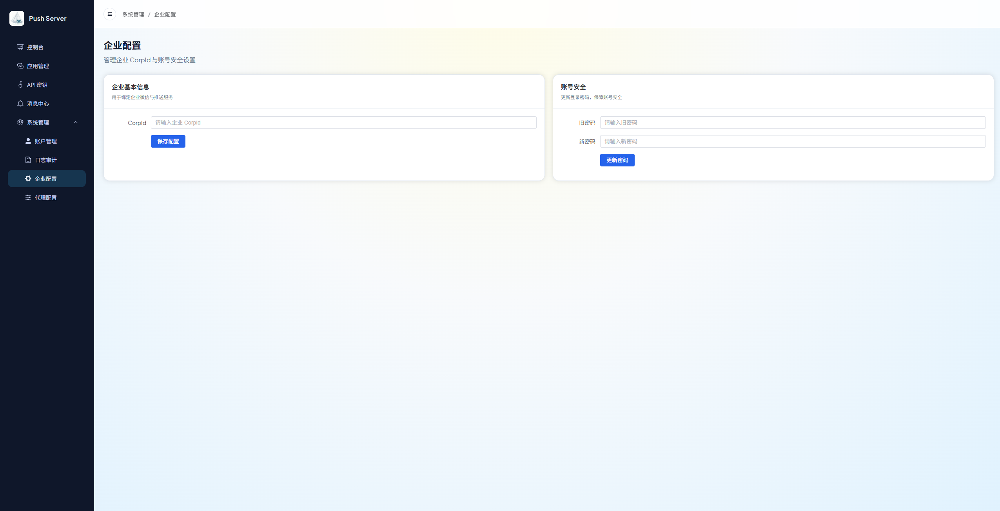

### 五、应用配置

接下来添加应用，从企业微信后台获取AgentId和Secret

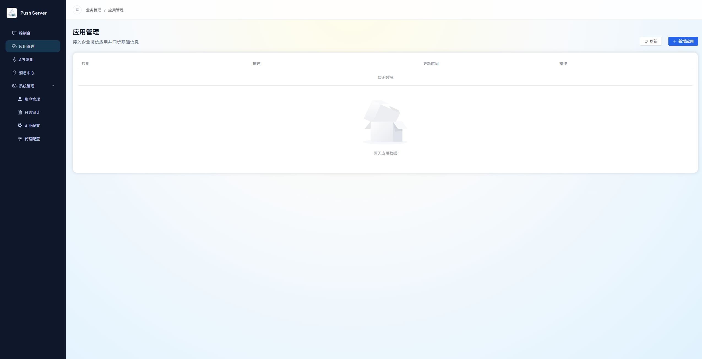

添加应用

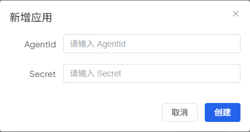

会自动同步应用信息

### 六、发送消息

在这里可以进行发送消息的测试，防止使用API接口发送时出现问题

支持：
- 普通文本
- MARKDOWN
- 卡片
- 图文

::: warning **注意**
Markdown 格式微信不支持，只有企业微信支持
:::

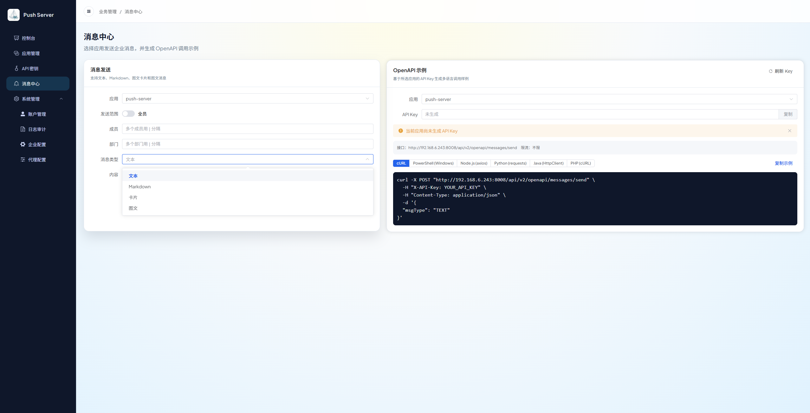

##### 微信端
|  | 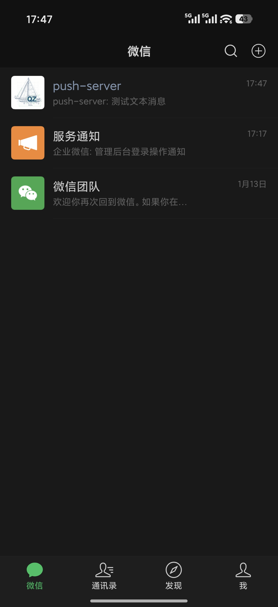 | 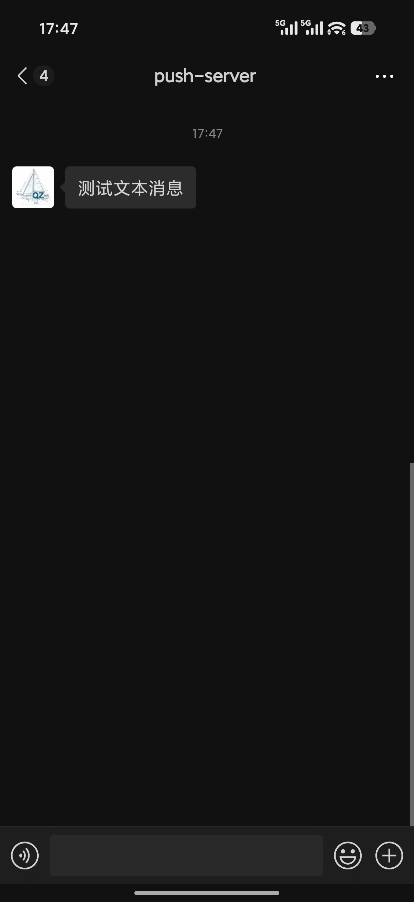 |
|:-----------------------------------------------------------------:| :---: | :---: |

### 七、API KEY

在此菜单可以生成第三方调用的密钥，并且可以设置限流，防止因为第三方出现问题导致消息轰炸

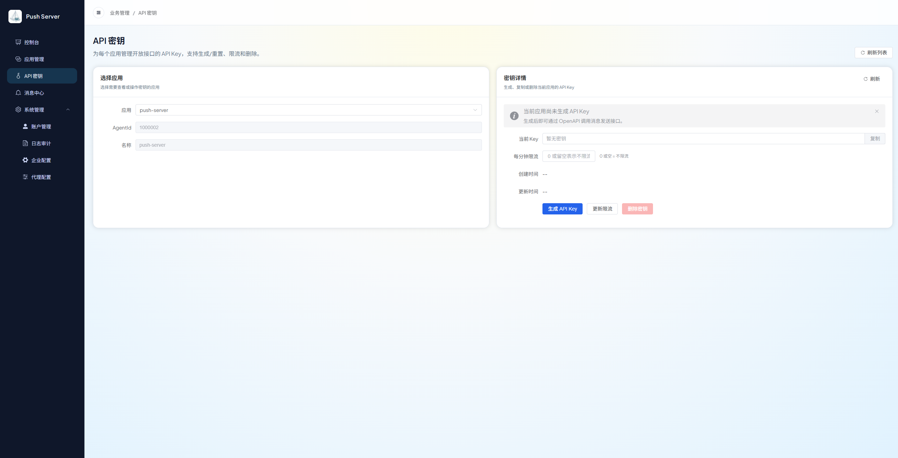

### 八、代理配置

提供了代理配置，方便配置统一的出口IP和可信IP

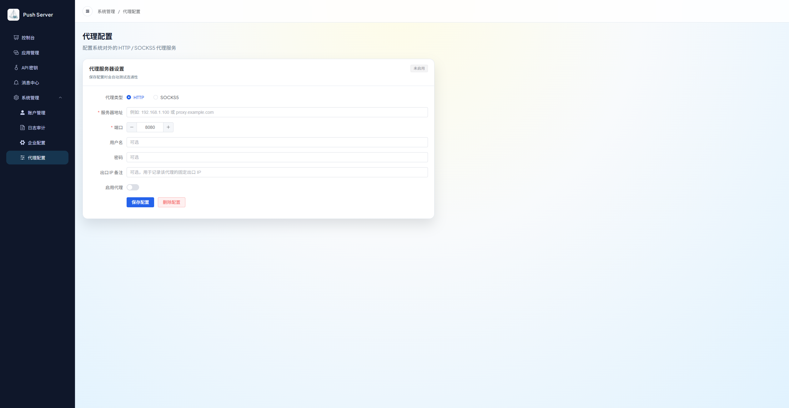

### 九、日志审计

提供全部消息的日志审计功能

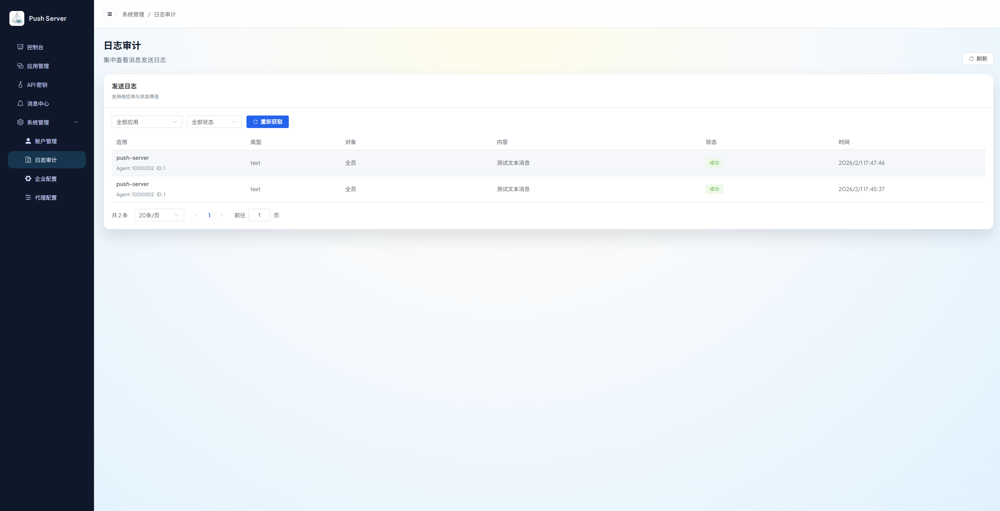