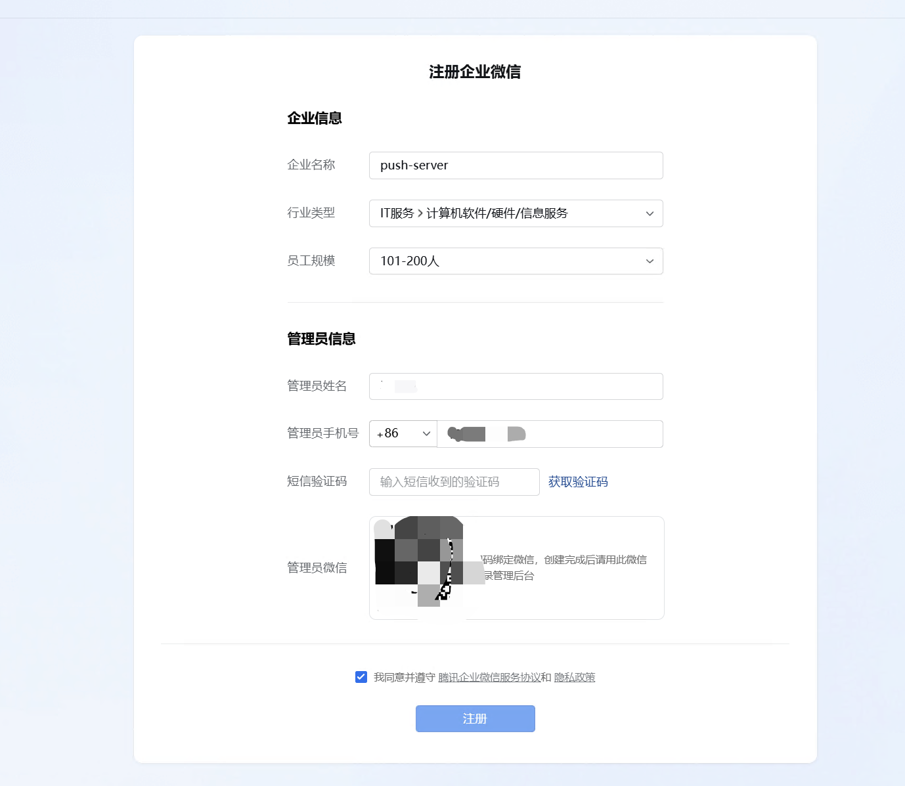
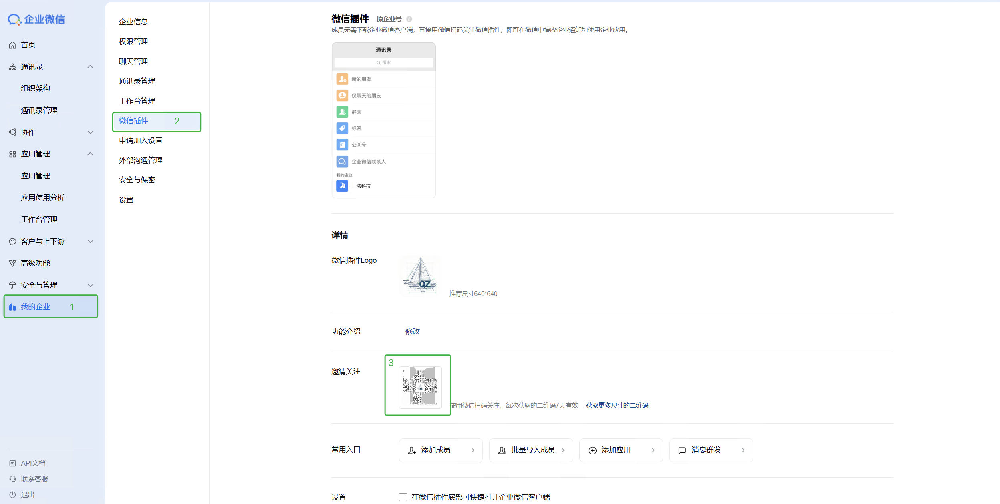
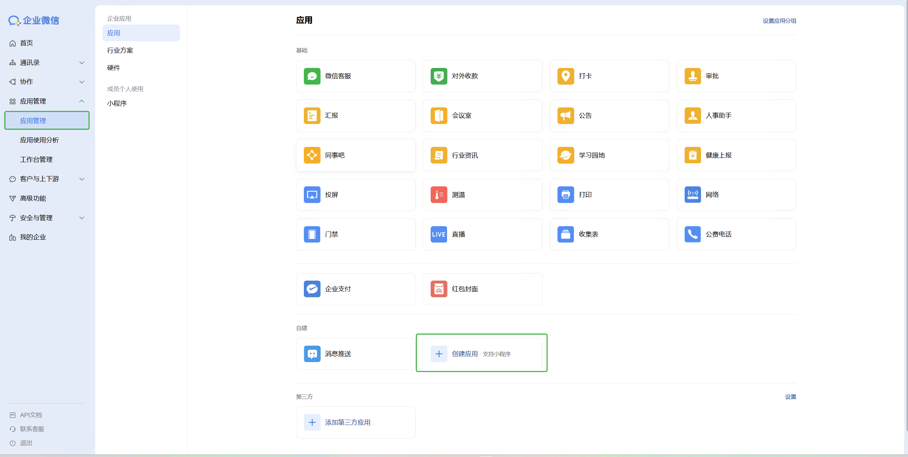
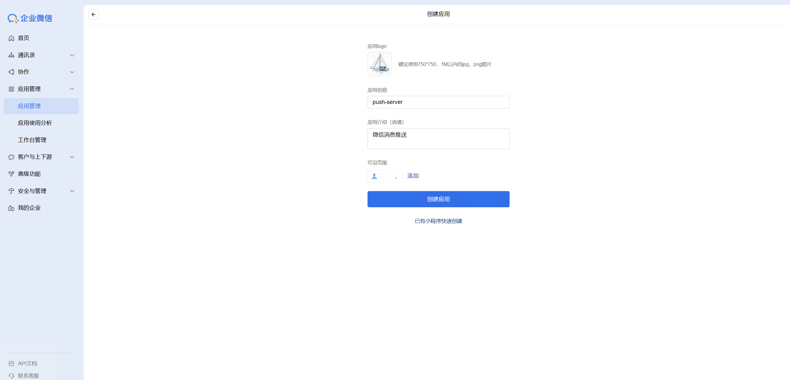
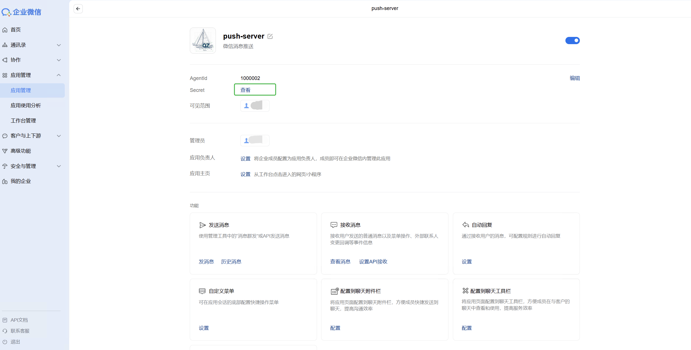
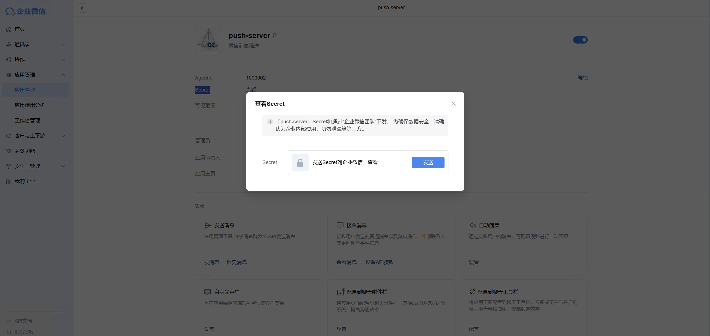
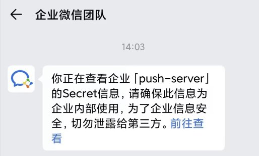

# 企业微信消息推送配置指南

本教程旨在指导用户如何注册企业微信并创建自建应用，以实现消息推送功能。

### 1. 注册企业微信

访问企业微信官网进行注册。个人用户也可以免费注册，无需企业认证。按页面提示完成注册流程，并使用微信扫描二维码绑定管理员。

### 2. 关注微信插件

登录企业微信管理后台，进入 **“我的企业” -> “微信插件”**。使用个人微信扫描二维码关注，以便在微信中直接接收企业应用的通知消息。

### 3. 创建自建应用

1. 进入 **“应用管理”** 页面，点击 **“创建应用”**。
2. 填写 **应用Logo**、**应用名称** 以及 **可见范围**（可以选择自己或特定部门）。
3. 点击 **“创建应用”** 完成创建。

### 4. 配置应用信息

#### 4.1 获取 Secret

应用创建成功后，会自动跳转到应用详情页。

1. 找到 **Secret** 字段，点击 **“查看”**。

2. 系统会发送一条确认消息到您的企业微信 App，需在手机端点击 **“发送”** 或 **“确认”**。

3. 确认后，页面将显示 Secret。**请务必妥善保存 Secret，不要泄露，它是调用 API 的重要凭证。**

#### 4.2 配置企业可信 IP

为了保障账号安全，企业微信要求配置企业可信 IP。只有来自可信 IP 的请求才会被允许调用接口。

1. 在应用详情页，找到 **“企业可信IP”** 配置项。
2. 点击配置，输入您部署推送服务的服务器 IP 地址。

*(注：还需要配置“网页授权及JS-SDK”的可信域名，则需要进行域名归属权校验。点击“申请校验域名”，下载校验文件并上传至您网站的根目录，确保可以通过公网访问该文件，然后点击确定即可。)*

### 5. 注意事项

如果您希望在微信（而非企业微信客户端）中接收消息，请确保满足以下条件：

1. **开启消息开关**：进入 **微信插件 -> 右上角 -> 设置**，确保 **“接收应用消息”** 已开启。
2. **应用状态正常**：应用不能处于停用状态（检查入口：**应用管理 -> 进入应用 -> 右上角 -> 启用/停用**）。
3. **允许微信插件使用**：在 **管理后台 -> 微信插件** 中，**不要勾选** “成员使用微信插件时需要使用企业微信客户端”。
4. **手机端设置**：在手机端企业微信 **左上角“≡” -> 设置 -> 新消息通知** 中，**不要勾选** “仅在企业微信中接收消息”。（此选项需关注微信插件后才可见）。
5. **群人数限制**：全员群人数若超过 2000 人，消息将不会同步到微信插件。

若以上条件均符合仍无法接收消息，可尝试取消关注微信插件后重新关注，并确保微信为最新版本。

*提示：在微信 PC 端查看过的消息，手机端微信将不会显示角标提醒。*